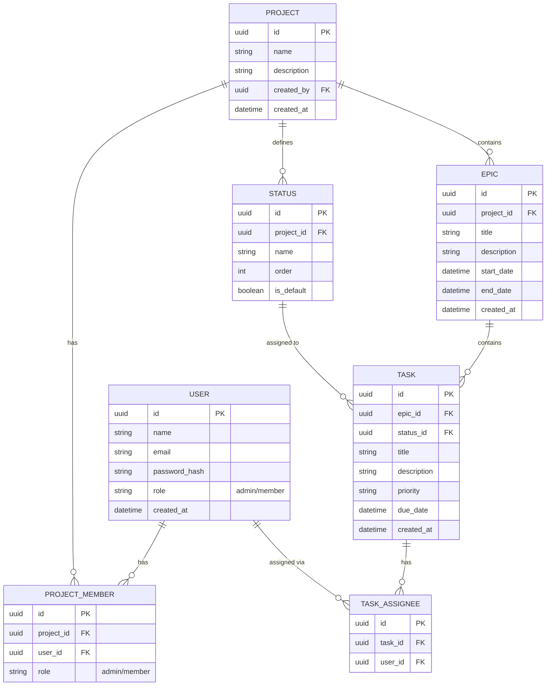

# Project Management API

Backend API untuk sistem manajemen project (mirip Jira / Linear sederhana) menggunakan **FastAPI + PostgreSQL + Docker**.

## Tech Stack

- **FastAPI** - Web framework
- **PostgreSQL** - Database
- **SQLAlchemy 2.0** - ORM
- **Docker & Docker Compose** - Containerization
- **JWT** - Authentication
- **Pydantic** - Data validation

## Project Structure

```text
.
├── app/
│   ├── __init__.py
│   ├── main.py              # Entry point
│   ├── database.py          # Database connection & session
│   ├── models.py             # SQLAlchemy models
│   ├── schemas.py            # Pydantic schemas
│   ├── security.py           # Password hashing & JWT
│   ├── dependencies.py
│   └── routers/
│       ├── __init__.py
│       └── auth.py           # Register & Login
├── .env
├── .gitignore
├── Dockerfile
├── docker-compose.yml
├── requirements.txt
└── README.md
```

## Database Schema



### Keterangan Relasi

| Relasi | Keterangan |
|---|---|
| USER → PROJECT_MEMBER | Satu user bisa menjadi member di banyak project |
| PROJECT → PROJECT_MEMBER | Satu project punya banyak member |
| PROJECT → EPIC | Satu project punya banyak epic |
| PROJECT → STATUS | Setiap project punya status sendiri (Todo, In Progress, dll) |
| EPIC → TASK | Satu epic berisi banyak task |
| STATUS → TASK | Setiap task punya satu status |
| TASK → TASK_ASSIGNEE | Satu task bisa di-assign ke banyak user |
| USER → TASK_ASSIGNEE | Satu user bisa di-assign ke banyak task |

## Prerequisites

- Docker Desktop
- Git

Tidak perlu install Python / PostgreSQL di local. Semua berjalan di dalam Docker.

## Getting Started

### 1. Clone repository

```bash
git clone <repository-url>
cd <repository-name>
```

### 2. Setup environment variables

Buat file `.env` di root project:

```env
POSTGRES_USER=postgres
POSTGRES_PASSWORD=password123
POSTGRES_DB=app_db
DATABASE_URL=postgresql://postgres:password123@db:5432/app_db

SECRET_KEY=ganti-dengan-secret-key-yang-panjang-dan-random-minimal-32-karakter
```

### 3. Jalankan project

```bash
docker compose up --build
```

API akan berjalan di: `http://localhost:8000`
Dokumentasi interaktif (Swagger UI): `http://localhost:8000/docs`

## Development

### Menjalankan ulang setelah perubahan code

Karena volume sudah di-mount, perubahan code biasanya langsung terdeteksi (hot reload).

Kalau ada perubahan dependency, jalankan ulang:

```bash
docker compose up --build
```

### Stop container

```bash
docker compose down
```

### Stop + hapus data database

```bash
docker compose down -v
```